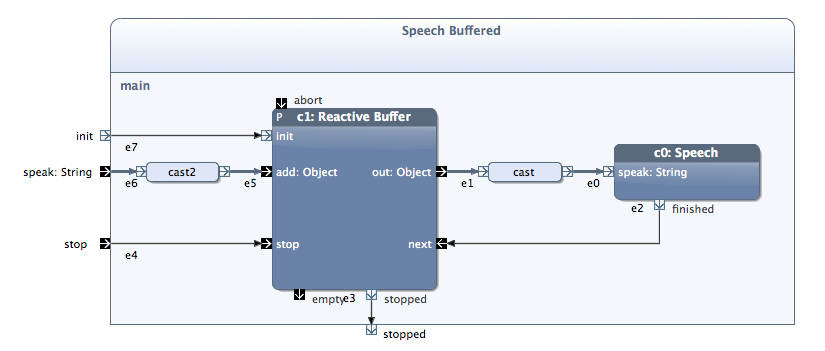

# Event Receptions

## Subtitle

### Paragraph

Check this <a href="/doc/creating_new_building_blocks" class="wikilink1" title="doc:creating_new_building_blocks">page</a> 
in order to create a new building block. Remember to choose <strong>State Machine Block</strong> 
template in the new building block wizard.

A State Machine block has <b>internal behavior</b> (State Machine), automatically generated external behavior (ESM), and optionally Java code.
This type of block is intended to be (re)used or instantiated within local blocks or system blocks.

	<h3>Create a new Block</h3>
  

Since this type of block is meant to be used in other enclosing blocks, it must have parameter nodes. When a State Machine block is instantiated these nodes are referred to as pins and used to connect the instance with other modelling elements. Parameter nodes for a State Machine block are defined within the Parameter Node table:
  

## Reactive Blocks
Reactive Blocks are a new type of software module, 
especially designed for event-driven systems. 
Reactive blocks encapsulate and tightly couple:

  - an Activity diagram to represent the data flow graphically 
    by describing concurrent behavior and synchronization
  - Java code to describe detailed operations
  - an External State Machine (ESM) to provide a behavioral 
    contract between the block and its environment by describing 
    the sequence in which the features of the block can be used legally

Actions define what is happening when a transition is executed. Each transition towards a normal state may have an arbitrary number of actions. An action can be

<ul>
<li class="level1">
 an output pin (STM table: “out <em>pinName</em>;”)

</li>
<li class="level1">
 a terminating pin (STM table: “out <em>pinName</em>;”)

</li>
<li class="level1">
 a method call (STM table: “call <em>methodName</em>;)

</li>
<li class="level1">
 a start timer action (STM table: “start <em>timerName</em>;”)

</li>
<li class="level1">
 a stop timer action (STM table: “stop <em>timerName</em>;”)

</li>
</ul>

